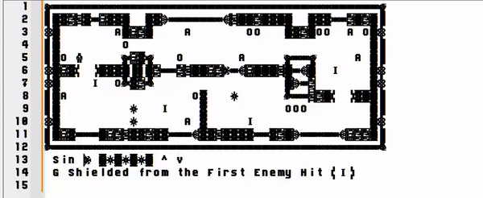
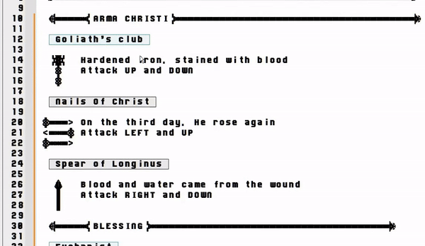
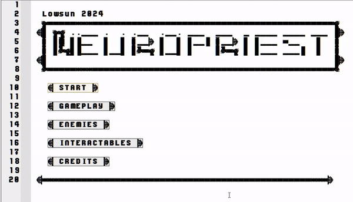

<p align="center">
  
</p>
<p align="center">
  <b>Rogue-lite as a Notepad++ Plugin</b>
</p>

## Features
* Six levels of turn based gameplay
* Collect and choose powerful relics
* Defeat bosses and weave through traps
* Storyline and audio

## Warning
Play at your own risk (losing data, settings, ect). 64 bit Windows only. Tested on Windows 10 and 11 on Notepad version 8.6.8.

## How to Install

1. Download the [latest release](https://github.com/thelowsunoverthemoon/NeuroPriest/releases/latest) and unzip
2. Install the font from the **Font** folder
3. Add the theme to Notepad++ from the **Theme** folder by drag and drop (usually in ```C:\Program Files\Notepad++\themes```)
4. Add the plugin to Notepad++ from the **Plugin** folder by drag and drop  (usually in ```C:\Program Files\Notepad++\plugins```)
5. Press ```PLAY``` in the plugin menu (may have to start Notepad++ in admin mode)

## Gameplay



